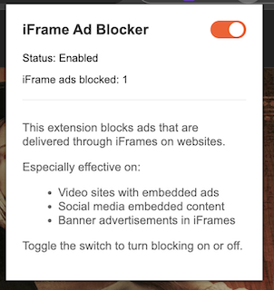

# iFrame Ad Blocker

A lightweight Chrome extension that blocks advertisements delivered through iFrames on websites, enhancing your browsing experience.

## Features

- **Targeted Ad Blocking**: Specifically blocks ads that are delivered through iFrames
- **Performance Optimized**: Lightweight implementation with minimal impact on browsing speed
- **Privacy Enhancement**: Limits tracking in embedded frames
- **Stats Tracking**: See how many iframe-based ads have been blocked
- **Simple Controls**: Easy on/off toggle when you need to temporarily disable blocking
- **Automatic Operation**: Works in the background without requiring configuration

## How It Works

iFrame Ad Blocker targets and restricts advertisements that are loaded through iFrames by applying sandbox attributes to them. This approach:

- Blocks most iframe-based ads in video players
- Stops iframe-based banner advertisements
- Maintains website functionality while removing intrusive content

## Works Best On

- Video Streaming Sites
- News Websites
- Blog Platforms
- Social Media with embedded content

## Installation

1. Download this repository as a ZIP file and extract it
2. Open Chrome and navigate to `chrome://extensions/`
3. Enable "Developer mode" (toggle in the top-right corner)
4. Click "Load unpacked" and select the extracted folder

## Usage

- The extension works automatically in the background
- Click the extension icon in your toolbar to:
  - See how many iframe-based ads have been blocked
  - Toggle the extension on/off
  - Get information about the extension's effectiveness

## Screenshots

## Contributing

Contributions are welcome! If you'd like to improve the extension

## Visitors Count

